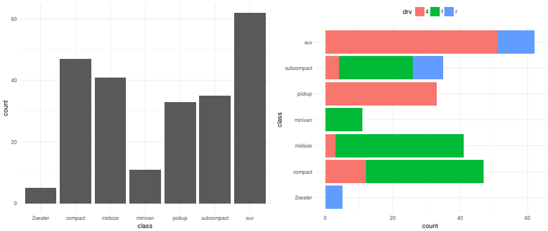
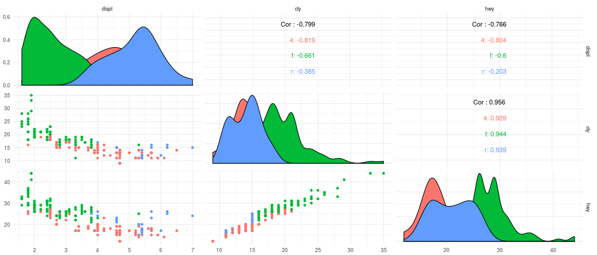

## AED

El _AED_ reúne un conjunto de técnicas provenientes de la estadística descriptiva y el análisis gráfico que tiene por objetivo:

> - Entender las propiedades y características de los datos 

> - Encontrar patrones latentes en los datos 

> - Sugerir estrategias de modelación de los datos 

> - "Depurar" el análisis 

> - Comunicar resultados 

---

## AED

El _AED_ a su vez se puede entender teniendo en cuenta distintas perspectivas debido a su relevancia en el proceso de análisis de datos 

> - Tipos de variables 

> - Dimensión de los datos 

> - Tipo de estudio 

---

## AED - Variables 

 
- **Numéricas (Cuantitativas):** Valores numéricos 

   - _Continuas_: Número infinito de valores dentro de un rango determinado  
   - _Discretas_: Conjunto especifico de valores que pueden ser contados o enumerados 
   
- **Categóricas (Cualitativas):** Un número limitado de distintas categorías

   - _Ordinales_: Número finito de valores dentro de un rango determinado

---

## AED - Variables 

### Categóricas 

- Son importantes para la modelación 

- Permiten explicar mejor los problemas 

- Conteos de frecuencias, resúmenes y subgrupos 

- Dependiendo de la dimensión, se pueden utilizar, Tablas, diagramas de Barra, Gantt, Mosaicos, etc. 

---

## AED - Variables 

### Numéricas  

- Son importantes para la modelación 

- Permiten las estimaciones y cálculos inferenciales 

- Dependiendo de la dimensión, se pueden utilizar, Histogramas, Boxplots, Densidades, etc.

---

## AED - Dimensiones 

Teniendo en cuenta la dimensión de los datos a estudiar (Univariada o Multivariada) el AED se centra en la causalidad y posibles relaciones entre las variables 

- Estadística descriptiva:

$$\bar{x}=\sum_{i=1}^n x_i;\quad S^2=\frac{\sum_{x=1}^n(x_i-\bar{x})}{n-1};r_{xy}=\frac{S_{xy}}{S_xS_y}$$

- Análisis factorial y reducción de la dimensión  

  - _ACP_ y _DVS_
  
- Gráficos multivariados  (Ejemplos) 

---

## AED - Tipos de estudio 

- **Estudios de observación:** 

   - Recopilar datos de una manera que no interfiera directamente con la forma en que surgen.
   - Sólo se puede deducir la correlación
   
- **Experimental**

   - Asignar aleatoriamente a los sujetos a varios tratamientos
   - Se puede inferir la causalidad
   

--- 

## AED - Ejemplos 

_"Fuel economy data from 1999 and 2008 for 38 popular models of car"_, este conjunto de datos contiene una muestra del análisis de economía en combustible que la **EPA** pone a disposición en [EPA Fuel Economy](http://fueleconomy.gov)

|manufacturer |model | displ| year| cyl|trans      |drv | cty| hwy|fl |class   |
|:------------|:-----|-----:|----:|---:|:----------|:---|---:|---:|:--|:-------|
|audi         |a4    |   1.8| 1999|   4|auto(l5)   |f   |  18|  29|p  |compact |
|audi         |a4    |   1.8| 1999|   4|manual(m5) |f   |  21|  29|p  |compact |
|audi         |a4    |   2.0| 2008|   4|manual(m6) |f   |  20|  31|p  |compact |
|audi         |a4    |   2.0| 2008|   4|auto(av)   |f   |  21|  30|p  |compact |
|audi         |a4    |   2.8| 1999|   6|auto(l5)   |f   |  16|  26|p  |compact |
|audi         |a4    |   2.8| 1999|   6|manual(m5) |f   |  18|  26|p  |compact |

---

## AED - Ejemplos 

### Variables 

---

## AED - Ejemplos 

### Variables 

---

## AED - Ejemplos 

### Variables 

---

## AED - Ejemplos 

### Dimensión  

---

## AED - Ejemplos 

### Tipo de estudio 

---

## AED - Ejemplos 

### Tipo de estudio 

